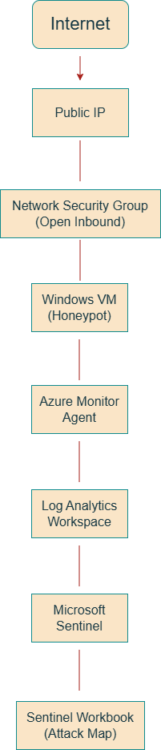

# SOC-honeypot-attack-detection
Project Overview

This project demonstrates a cloud-based Security Operations Center (SOC) lab built using Microsoft Azure. A Windows virtual machine was intentionally exposed to the public internet to capture real-world attack activity. Security logs were centrally collected, analyzed, and visualized using Microsoft Sentinel and Kusto Query Language (KQL).
The goal of this lab was to gain hands-on experience with SIEM workflows, log analysis, and threat visibility in a controlled and disposable cloud environment.

Architecture Overview

The lab architecture includes:

Windows Virtual Machine (Honeypot)
Internet-facing VM designed to attract authentication attacks.

Network Security Group (NSG)
Configured to allow inbound traffic for attack simulation.

Azure Monitor Agent
Forwards Windows security logs to Azure.

Log Analytics Workspace
Central repository for collected logs.

Microsoft Sentinel (SIEM)
Used for querying, analysis, and visualization.

All components were deployed within a single Azure resource group for easy management and teardown.

Log Collection

Security data was collected from the Windows VM using the Azure Monitor Agent and ingested into a Log Analytics Workspace.

Primary log source:

Windows Security Event Logs
  Focused on Event ID 4625 (failed logon attempts)

Event ID 4625 is commonly associated with brute-force authentication activity and is a key signal monitored by SOC teams.

Detection & Analysis
Log analysis was performed using KQL to identify and investigate failed authentication attempts.
Example Query – Failed Logons
[Failed Logons](screenshots/log-analytics-failed-logons)
[Top Attacker IPs](screenshots/top-attacker-ips)

SecurityEvent
| where EventID == 4625
| summarize count() by IpAddress
| order by count_ desc

This query identifies source IP addresses responsible for repeated failed login attempts.
Additional queries are available in the /queries directory.

Geolocation Enrichment

To provide geographic context, attacker IP addresses were enriched using a Microsoft Sentinel Watchlist containing IP-to-location mappings.

This enrichment enabled:

Country and city identification
Latitude and longitude mapping
Aggregation of attack activity by region
Geolocation was used strictly for trend analysis, not attacker attribution.

Visualization

A Microsoft Sentinel Workbook was created to visualize attack activity on a global map.

The visualization highlights:

Geographic distribution of failed login attempts

Relative attack volume by region

Concentrated brute-force activity from specific locations

This demonstrates how quickly exposed systems are discovered and targeted once accessible from the internet.
[Attack Map](screenshots/sentinel-attack-map)

Key Findings

Internet-facing systems receive authentication attacks shortly after exposure
Most attacks target common usernames such as admin, administrator, and generic user accounts
Attack activity originates from multiple geographic regions
High-volume attempts appear automated and repetitive

Limitations

This lab was intentionally scoped for learning purposes and has the following limitations:

Single Windows-based honeypot
No automated alerting or response actions
Geolocation data may be inaccurate due to VPNs or proxies
Focus limited to authentication-based attacks

Future Improvements

Potential enhancements include:

Creating Sentinel analytics rules and alerts
Adding a Linux VM to analyze SSH brute-force attempts
Integrating Microsoft Defender for Endpoint
Implementing basic response actions (IP blocking, incident creation)
Expanding to additional log sources (Azure Activity Logs, NSG flow logs)

Lessons Learned

Exposed cloud assets are discovered and targeted quickly

Centralized logging is critical for visibility and investigation

Effective SIEM use requires filtering, enrichment, and context

Visualizations support analysis but do not replace investigation

(See notes/lessons-learned.md for detailed observations.)

Disclaimer

This project was conducted in a disposable Azure environment for educational purposes only.
All exposed resources were decommissioned after analysis to avoid unnecessary risk or cost.
